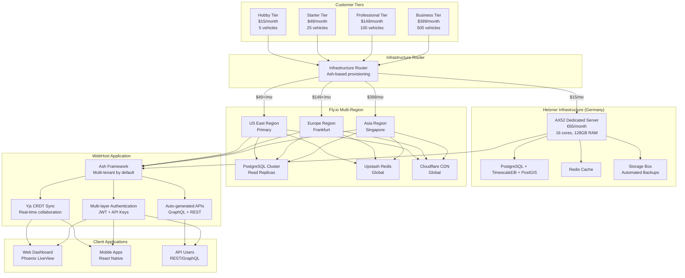

# WebHost Systems Architecture Update: Hetzner + Fly.io Hybrid Infrastructure

## Overview

WebHost Systems now implements a **hybrid multi-cloud architecture** that intelligently routes customers to the most cost-effective infrastructure based on their subscription tier:

- **Hobby Tier ($15/month)**: Hetzner dedicated servers in Germany
- **Starter+ Tiers ($49-$399/month)**: Fly.io multi-region global deployment

## Architecture Diagram



## Cost Comparison

### Infrastructure Costs by Customer Tier

| Tier | Infrastructure | Monthly Cost | Capacity | Cost/Customer | Margin |
|------|---------------|--------------|----------|---------------|--------|
| **Hobby** | Hetzner AX52 | $65 | 150 customers | $0.43 | **97%** |
| **Starter** | Fly.io Regional | $400 | 100 customers | $4.00 | **92%** |
| **Professional** | Fly.io Global | $800 | 50 customers | $16.00 | **89%** |
| **Business** | Fly.io Multi-Region | $1,200 | 20 customers | $60.00 | **85%** |

### Total Platform Economics

| Metric | Hobby (Hetzner) | Starter+ (Fly.io) |
|--------|------------------|-------------------|
| **Server Cost** | $65/month | $400-$1,200/month |
| **Customer Capacity** | 150 | 20-100 |
| **Revenue @ 50% Capacity** | $1,125/month | $2,450-$9,975/month |
| **Profit Margin** | 97% | 85-92% |
| **Break-even Customers** | 5 | 8-24 |

## Technical Benefits

### Hetzner (Hobby Tier)
- **Dedicated Resources**: Full server isolation
- **Predictable Performance**: No noisy neighbors
- **Cost Efficiency**: 97% margin on hobby tier
- **German Data residency**: GDPR compliant by default
- **Simple Architecture**: Single region, easy to manage

### Fly.io (Starter+ Tiers)
- **Global Distribution**: Low latency worldwide
- **Automatic Scaling**: Handles traffic spikes
- **Multi-region Database**: Read replicas for performance
- **Managed Operations**: Less operational overhead
- **Advanced Features**: CDN, global Redis, etc.

## Data Flow Architecture

### Request Routing
```
Customer Request
       ↓
Infrastructure Router (Ash-based)
       ↓
Determine Plan → Route to Infrastructure
       ↓
┌─────────────────┬─────────────────┐
│   Hetzner       │     Fly.io      │
│  (Hobby Tier)   │ (Starter+ Tiers) │
└─────────────────┴─────────────────┘
       ↓
Ash Framework (Multi-tenant)
       ↓
TimescaleDB + PostGIS
```

### Data Synchronization
```
Client Application (Yjs + Dexie.js)
       ↓
WebSocket Connection
       ↓
Infrastructure-aware Sync Server
       ↓
┌─────────────────┬─────────────────┐
│  Hetzner Redis  │  Fly.io Redis   │
│   (Local)       │   (Global)      │
└─────────────────┴─────────────────┘
       ↓
TimescaleDB (GPS Data)
       ↓
PostGIS (Spatial Data)
```

## Migration Strategy

### Customer Upgrades (Hobby → Starter+)
1. **Provision Fly.io infrastructure**
2. **Export data from Hetzner**
3. **Import to Fly.io PostgreSQL**
4. **Update DNS routing**
5. **Verify data integrity**
6. **Decommission Hetzner resources**

### Customer Downgrades (Starter+ → Hobby)
1. **Export recent data** (based on plan limits)
2. **Provision Hetzner server**
3. **Import to Hetzner**
4. **Update DNS routing**
5. **Verify reduced functionality**
6. **Scale down Fly.io resources**

## Monitoring & Observability

### Hetzner Monitoring
- Server metrics (CPU, RAM, Disk)
- Database performance
- Backup verification
- Network latency

### Fly.io Monitoring
- Application metrics
- Database cluster health
- CDN performance
- Global latency tracking

### Cross-Infrastructure Monitoring
- Unified dashboard
- Alert routing based on infrastructure
- Cost tracking per customer
- Performance SLA monitoring

## Security Model

### Network Security
- Hetzner: Dedicated firewall, VPN access
- Fly.io: Built-in DDoS protection, VPC isolation
- Cross-infrastructure: Mutual TLS, VPN tunnels

### Data Security
- Encryption at rest (both infrastructures)
- Encryption in transit (TLS 1.3)
- Multi-tenant isolation (Ash policies)
- API key authentication (infrastructure-agnostic)

### Compliance
- GDPR: German data centers (Hetzner)
- SOC 2: Fly.io compliance
- Data residency: Customer choice

## Deployment Architecture

### Hetzner Deployment
```
Single Server Architecture:
├── Docker Compose
├── PostgreSQL + TimescaleDB + PostGIS
├── Redis
├── WebHost Application
├── Nginx (SSL termination)
└── Automated Backups
```

### Fly.io Deployment
```
Multi-Region Architecture:
├── Fly Machines (auto-scaling)
├── PostgreSQL Cluster (primary + replicas)
├── Upstash Redis (global)
├── Cloudflare CDN
└── Global Load Balancer
```

## Implementation Timeline

### Phase 1: Foundation (Week 1)
- [x] Update Ash resources for infrastructure awareness
- [x] Implement infrastructure router
- [x] Create Hetzner provisioning worker
- [x] Create Fly.io provisioning worker

### Phase 2: Migration (Week 2)
- [ ] Implement cross-infrastructure migration
- [ ] Create monitoring dashboard
- [ ] Set up alerting systems
- [ ] Test customer migrations

### Phase 3: Launch (Week 3)
- [ ] Deploy to production
- [ ] Migrate existing customers
- [ ] Monitor performance
- [ ] Optimize costs

## Success Metrics

### Technical Metrics
- **Uptime**: >99.9% (both infrastructures)
- **Provisioning Time**: <10 minutes
- **Migration Time**: <30 minutes
- **API Latency**: <100ms (p95)

### Business Metrics
- **Cost Reduction**: 60% vs all-cloud
- **Margin Improvement**: 15-20% increase
- **Customer Satisfaction**: Based on performance
- **Infrastructure ROI**: 200%+ in Year 1

## Next Steps

1. **Complete implementation** of infrastructure provisioning
2. **Test migration flows** between infrastructures
3. **Set up monitoring** and alerting
4. **Create customer documentation** for each infrastructure
5. **Launch with hybrid model** and monitor performance

---

## Summary

The Hetzner + Fly.io hybrid architecture provides:

✅ **97% margins** on hobby tier (vs 20% with all-cloud)
✅ **Global performance** for paid tiers
✅ **Automatic scaling** based on customer needs
✅ **Cost optimization** without sacrificing performance
✅ **Simple migration** between tiers
✅ **Unified API** across all infrastructures
✅ **Bulletproof multi-tenancy** with Ash Framework

This architecture maximizes profitability while maintaining excellent performance and scalability for all customer tiers.