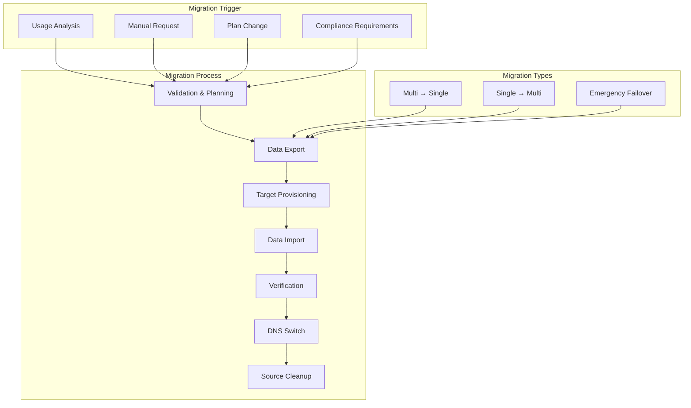

# WebHost Systems Deployment Migration Strategy

## Overview

This document outlines the comprehensive strategy for migrating customers between multi-tenant and single-tenant deployment modes. The migration process ensures zero-downtime transitions, data integrity, and minimal customer impact.

## Migration Architecture



---

## Migration Types

### 1. Upgrade Migration (Multi-Tenant → Single-Tenant)

**Use Cases:**
- Customer exceeds hobby plan limits
- Need for higher performance
- Compliance requirements (SOC 2, HIPAA)
- Geographic distribution needs

**Process Flow:**
```elixir
defmodule WebHost.Workers.UpgradeToSingleTenantWorker do
  use Oban.Worker,
    queue: :migration,
    max_attempts: 3,
    backoff: :exponential

  @impl Oban.Worker
  def perform(%Oban.Job{args: args}) do
    customer_id = args["customer_id"]
    target_plan = String.to_atom(args["target_plan"] || "starter")
    target_regions = args["target_regions"] || ["iad"]
    
    Logger.info("Starting upgrade migration for customer #{customer_id}")
    
    with {:ok, customer} <- get_customer(customer_id),
         {:ok, migration_plan} <- plan_migration(customer, :upgrade, target_plan),
         {:ok, export_data} <- export_customer_data(customer, migration_plan),
         {:ok, deployment} <- provision_single_tenant_infrastructure(customer, target_plan, target_regions),
         {:ok, _} <- import_data_to_single_tenant(customer, deployment, export_data),
         {:ok, _} <- verify_migration_integrity(customer, deployment, export_data),
         {:ok, _} <- update_dns_to_single_tenant(customer, deployment),
         {:ok, _} <- update_customer_metadata(customer, deployment) do
      
      # Schedule source cleanup after 7 days
      schedule_source_cleanup(customer_id, deployment.id)
      
      # Send success notification
      send_migration_success_notification(customer, :upgrade)
      
      Logger.info("Upgrade migration completed for customer #{customer_id}")
      :ok
    else
      {:error, reason} ->
        Logger.error("Upgrade migration failed for customer #{customer_id}: #{inspect(reason)}")
        send_migration_failure_notification(customer_id, :upgrade, reason)
        {:error, reason}
    end
  end
end
```

### 2. Downgrade Migration (Single-Tenant → Multi-Tenant)

**Use Cases:**
- Customer reduces usage below hobby limits
- Cost optimization request
- Business downsizing
- Plan downgrade

**Process Flow:**
```elixir
defmodule WebHost.Workers.DowngradeToMultiTenantWorker do
  use Oban.Worker,
    queue: :migration,
    max_attempts: 3,
    backoff: :exponential

  @impl Oban.Worker
  def perform(%Oban.Job{args: args}) do
    customer_id = args["customer_id"]
    data_retention_days = args["data_retention_days"] || 30
    
    Logger.info("Starting downgrade migration for customer #{customer_id}")
    
    with {:ok, customer} <- get_customer(customer_id),
         {:ok, migration_plan} <- plan_migration(customer, :downgrade, :hobby),
         {:ok, export_data} <- export_limited_customer_data(customer, migration_plan, data_retention_days),
         {:ok, slot_info} <- find_multi_tenant_slot(customer),
         {:ok, _} <- import_data_to_multi_tenant(customer, slot_info, export_data),
         {:ok, _} <- verify_downgrade_integrity(customer, export_data),
         {:ok, _} <- update_dns_to_multi_tenant(customer, slot_info),
         {:ok, _} <- update_customer_metadata(customer, slot_info),
         {:ok, _} <- cleanup_single_tenant_infrastructure(customer) do
      
      # Send success notification
      send_migration_success_notification(customer, :downgrade)
      
      Logger.info("Downgrade migration completed for customer #{customer_id}")
      :ok
    else
      {:error, reason} ->
        Logger.error("Downgrade migration failed for customer #{customer_id}: #{inspect(reason)}")
        send_migration_failure_notification(customer_id, :downgrade, reason)
        {:error, reason}
    end
  end
end
```

### 3. Emergency Migration (Failover)

**Use Cases:**
- Infrastructure failure
- Security incident
- Performance degradation
- Natural disaster

**Process Flow:**
```elixir
defmodule WebHost.Workers.EmergencyMigrationWorker do
  use Oban.Worker,
    queue: :emergency,
    max_attempts: 1,
    priority: 10

  @impl Oban.Worker
  def perform(%Oban.Job{args: args}) do
    customer_id = args["customer_id"]
    failure_reason = args["failure_reason"]
    target_mode = String.to_atom(args["target_mode"])
    
    Logger.error("Emergency migration triggered for customer #{customer_id}: #{failure_reason}")
    
    # Immediate provisioning with minimal validation
    with {:ok, customer} <- get_customer(customer_id),
         {:ok, emergency_deployment} <- emergency_provision(customer, target_mode),
         {:ok, _} <- immediate_dns_switch(customer, emergency_deployment),
         {:ok, _} -> notify_emergency_migration(customer, failure_reason, emergency_deployment) do
      
      # Schedule data migration after emergency provisioning
      schedule_data_migration(customer_id, emergency_deployment.id)
      
      Logger.info("Emergency migration completed for customer #{customer_id}")
      :ok
    else
      {:error, reason} ->
        Logger.critical("Emergency migration failed for customer #{customer_id}: #{inspect(reason)}")
        send_emergency_failure_notification(customer_id, reason)
        {:error, reason}
    end
  end
end
```

---

## Data Migration Process

### Data Export Strategy

#### Multi-Tenant Export
```elixir
defmodule WebHost.Migration.DataExporter do
  @moduledoc """
  Handles data export for migration scenarios
  """

  def export_customer_data(customer, migration_plan) do
    Logger.info("Starting data export for customer #{customer.id}")
    
    export_manifest = %{
      customer_id: customer.id,
      export_timestamp: DateTime.utc_now(),
      migration_type: migration_plan.type,
      data_version: "1.0"
    }
    
    # Export structured data
    structured_data = %{
      customer: export_customer_info(customer),
      vehicles: export_vehicles(customer),
      drivers: export_drivers(customer),
      geofences: export_geofences(customer),
      api_keys: export_api_keys(customer),
      subscriptions: export_subscriptions(customer)
    }
    
    # Export time-series data (with limits)
    timeseries_data = %{
      gps_positions: export_gps_positions(customer, migration_plan),
      usage_metrics: export_usage_metrics(customer, migration_plan)
    }
    
    # Create export package
    export_package = %{
      manifest: export_manifest,
      structured_data: structured_data,
      timeseries_data: timeseries_data,
      checksums: calculate_checksums(structured_data, timeseries_data)
    }
    
    # Store export in temporary storage
    case store_export_package(export_package) do
      {:ok, storage_info} ->
        Logger.info("Data export completed for customer #{customer.id}")
        {:ok, %{storage_info: storage_info, package: export_package}}
      
      {:error, reason} ->
        Logger.error("Data export failed for customer #{customer.id}: #{inspect(reason)}")
        {:error, reason}
    end
  end

  defp export_gps_positions(customer, migration_plan) do
    retention_days = get_retention_days(migration_plan)
    cutoff_date = DateTime.add(DateTime.utc_now(), -retention_days * 24 * 60 * 60, :second)
    
    # Query GPS positions with customer isolation
    customer_id = customer.id
    
    query = """
    SELECT id, vehicle_id, time, latitude, longitude, speed, heading, 
           accuracy, altitude, metadata, created_at
    FROM gps_positions 
    WHERE customer_id = $1 
      AND time >= $2
    ORDER BY time ASC
    """
    
    case Repo.query(query, [customer_id, cutoff_date]) do
      {:ok, %Postgrex.Result{rows: rows}} ->
        Logger.info("Exported #{length(rows)} GPS positions for customer #{customer.id}")
        %{rows: rows, count: length(rows), cutoff_date: cutoff_date}
      
      {:error, reason} ->
        Logger.error("Failed to export GPS positions for customer #{customer.id}: #{inspect(reason)}")
        {:error, reason}
    end
  end

  defp get_retention_days(%{type: :upgrade, target_plan: :hobby}), do: 30
  defp get_retention_days(%{type: :upgrade, target_plan: :starter}), do: 90
  defp get_retention_days(%{type: :upgrade, target_plan: :professional}), do: 365
  defp get_retention_days(%{type: :upgrade, target_plan: :business}), do: 730
  defp get_retention_days(%{type: :downgrade}), do: 30
  defp get_retention_days(_), do: 90
end
```

#### Data Import Strategy
```elixir
defmodule WebHost.Migration.DataImporter do
  @moduledoc """
  Handles data import for migration scenarios
  """

  def import_data_to_single_tenant(customer, deployment, export_data) do
    Logger.info("Starting data import for customer #{customer.id} to single-tenant deployment")
    
    # Connect to target database
    target_repo = get_target_repo(deployment)
    
    # Verify data integrity before import
    case verify_export_integrity(export_data) do
      :ok ->
        # Import in transaction
        target_repo.transaction(fn ->
          with {:ok, _} <- import_structured_data(target_repo, export_data.structured_data, customer),
               {:ok, _} <- import_timeseries_data(target_repo, export_data.timeseries_data, customer),
               {:ok, _} <- update_sequences(target_repo) do
            Logger.info("Data import completed for customer #{customer.id}")
            :ok
          else
            {:error, reason} ->
              Logger.error("Data import failed for customer #{customer.id}: #{inspect(reason)}")
              target_repo.rollback()
              {:error, reason}
          end
        end)
      
      {:error, reason} ->
        Logger.error("Export integrity verification failed for customer #{customer.id}: #{inspect(reason)}")
        {:error, reason}
    end
  end

  defp import_structured_data(repo, data, customer) do
    # Import customer info (update existing)
    {:ok, _} = update_customer_info(repo, data.customer, customer)
    
    # Import vehicles
    {:ok, _} = import_vehicles(repo, data.vehicles, customer.id)
    
    # Import drivers
    {:ok, _} = import_drivers(repo, data.drivers, customer.id)
    
    # Import geofences
    {:ok, _} = import_geofences(repo, data.geofences, customer.id)
    
    # Import API keys
    {:ok, _} = import_api_keys(repo, data.api_keys, customer.id)
    
    :ok
  end

  defp import_timeseries_data(repo, data, customer) do
    # Import GPS positions in batches
    case data.gps_positions do
      %{rows: gps_rows, count: gps_count} when gps_count > 0 ->
        Logger.info("Importing #{gps_count} GPS positions for customer #{customer.id}")
        
        # Batch insert for performance
        batch_size = 1000
        gps_rows
        |> Enum.chunk_every(batch_size)
        |> Enum.with_index(1)
        |> Enum.each(fn {batch, batch_num} ->
          insert_gps_batch(repo, batch, customer.id, batch_num, batch_size)
        end)
      
      _ ->
        Logger.info("No GPS positions to import for customer #{customer.id}")
    end
    
    # Import usage metrics
    case data.usage_metrics do
      %{rows: metric_rows, count: metric_count} when metric_count > 0 ->
        Logger.info("Importing #{metric_count} usage metrics for customer #{customer.id}")
        
        batch_size = 500
        metric_rows
        |> Enum.chunk_every(batch_size)
        |> Enum.each(fn batch ->
          insert_metrics_batch(repo, batch, customer.id)
        end)
      
      _ ->
        Logger.info("No usage metrics to import for customer #{customer.id}")
    end
    
    :ok
  end

  defp insert_gps_batch(repo, batch, customer_id, batch_num, batch_size) do
    # Prepare GPS data with customer_id
    gps_data = Enum.map(batch, fn row ->
      [id, vehicle_id, time, lat, lng, speed, heading, accuracy, altitude, metadata, created_at] = row
      
      %{
        id: id,
        customer_id: customer_id,
        vehicle_id: vehicle_id,
        time: time,
        latitude: lat,
        longitude: lng,
        speed: speed,
        heading: heading,
        accuracy: accuracy,
        altitude: altitude,
        metadata: metadata,
        created_at: created_at
      }
    end)
    
    # Insert batch
    repo.insert_all("gps_positions", gps_data, on_conflict: :nothing)
    
    Logger.debug("Inserted GPS batch #{batch_num} (#{length(gps_data)} records)")
  end
end
```

---

## Infrastructure Provisioning

### Single-Tenant Provisioning
```elixir
defmodule WebHost.Infrastructure.SingleTenantProvisioner do
  @moduledoc """
  Provisions dedicated Fly.io infrastructure for single-tenant deployments
  """

  def provision_infrastructure(customer, plan, regions) do
    Logger.info("Provisioning single-tenant infrastructure for customer #{customer.id}")
    
    with {:ok, app_name} <- create_fly_app(customer, plan),
         {:ok, database} <- create_fly_database(customer, plan, regions),
         {:ok, redis} <- create_fly_redis(customer, plan),
         {:ok, deployment} <- create_deployment_record(customer, app_name, database, redis, plan, regions),
         {:ok, _} <- configure_application(deployment),
         {:ok, _} <- setup_monitoring(deployment) do
      
      Logger.info("Single-tenant infrastructure provisioned for customer #{customer.id}")
      {:ok, deployment}
    else
      {:error, reason} ->
        Logger.error("Failed to provision single-tenant infrastructure for customer #{customer.id}: #{inspect(reason)}")
        {:error, reason}
    end
  end

  defp create_fly_app(customer, plan) do
    app_name = "webhost-customer-#{customer.id}"
    
    # Generate fly.toml configuration
    fly_config = generate_fly_config(customer, plan)
    
    # Create Fly.io app
    case FlyioClient.create_app(%{
      name: app_name,
      org_id: get_fly_org_id(),
      config: fly_config
    }) do
      {:ok, app} ->
        Logger.info("Created Fly.io app #{app_name} for customer #{customer.id}")
        {:ok, app}
      
      {:error, reason} ->
        Logger.error("Failed to create Fly.io app for customer #{customer.id}: #{inspect(reason)}")
        {:error, reason}
    end
  end

  defp create_fly_database(customer, plan, regions) do
    db_name = "webhost-customer-#{customer.id}"
    
    # Create PostgreSQL cluster
    case FlyioClient.create_database(%{
      name: db_name,
      version: "15",
      regions: regions,
      vm_size: get_database_vm_size(plan),
      volume_size: get_database_volume_size(plan),
      read_replicas: get_read_replica_count(plan)
    }) do
      {:ok, database} ->
        Logger.info("Created Fly.io database #{db_name} for customer #{customer.id}")
        {:ok, database}
      
      {:error, reason} ->
        Logger.error("Failed to create Fly.io database for customer #{customer.id}: #{inspect(reason)}")
        {:error, reason}
    end
  end

  defp get_database_vm_size(:starter), do: "shared-cpu-1x"
  defp get_database_vm_size(:professional), do: "performance-cpu-1x"
  defp get_database_vm_size(:business), do: "performance-cpu-2x"

  defp get_database_volume_size(:starter), do: 10
  defp get_database_volume_size(:professional), do: 50
  defp get_database_volume_size(:business), do: 200

  defp get_read_replica_count(:starter), do: 0
  defp get_read_replica_count(:professional), do: 1
  defp get_read_replica_count(:business), do: 2
end
```

### Multi-Tenant Slot Management
```elixir
defmodule WebHost.Infrastructure.MultiTenantSlotManager do
  @moduledoc """
  Manages available slots in multi-tenant Hetzner infrastructure
  """

  def find_available_slot(customer) do
    Logger.info("Finding available multi-tenant slot for customer #{customer.id}")
    
    # Check current server capacity
    case get_server_capacity() do
      {:ok, capacity} when capacity.available_slots > 0 ->
        # Assign slot to customer
        slot_info = %{
          server_id: capacity.server_id,
          slot_number: capacity.next_available_slot,
          database_url: capacity.database_url,
          redis_url: capacity.redis_url,
          api_url: generate_api_url(capacity.server_ip, customer.id)
        }
        
        # Reserve slot
        case reserve_slot(customer.id, slot_info) do
          :ok ->
            Logger.info("Reserved multi-tenant slot for customer #{customer.id}")
            {:ok, slot_info}
          
          {:error, reason} ->
            Logger.error("Failed to reserve slot for customer #{customer.id}: #{inspect(reason)}")
            {:error, reason}
        end
      
      {:ok, _capacity} ->
        Logger.error("No available slots in multi-tenant infrastructure")
        {:error, :no_available_slots}
      
      {:error, reason} ->
        Logger.error("Failed to get server capacity: #{inspect(reason)}")
        {:error, reason}
    end
  end

  defp get_server_capacity() do
    # Query current server metrics
    query = """
    SELECT 
      s.id as server_id,
      s.ip_address as server_ip,
      s.database_url,
      s.redis_url,
      (150 - COUNT(c.id)) as available_slots,
      COALESCE(MAX(c.slot_number) + 1, 1) as next_available_slot
    FROM hetzner_servers s
    LEFT JOIN customers c ON s.id = c.server_id AND c.status = 'active'
    WHERE s.status = 'active'
    GROUP BY s.id, s.ip_address, s.database_url, s.redis_url
    HAVING (150 - COUNT(c.id)) > 0
    ORDER BY available_slots DESC
    LIMIT 1
    """
    
    case Repo.query(query) do
      {:ok, %Postgrex.Result{rows: [row | _]}} ->
        {:ok, %{
          server_id: row[:server_id],
          server_ip: row[:server_ip],
          database_url: row[:database_url],
          redis_url: row[:redis_url],
          available_slots: row[:available_slots],
          next_available_slot: row[:next_available_slot]
        }}
      
      {:ok, %Postgrex.Result{rows: []}} ->
        {:ok, %{available_slots: 0}}
      
      {:error, reason} ->
        {:error, reason}
    end
  end
end
```

---

## DNS and Routing Management

### DNS Update Strategy
```elixir
defmodule WebHost.Infrastructure.DNSManager do
  @moduledoc """
  Manages DNS updates during migration to ensure zero downtime
  """

  def update_dns_for_migration(customer, target_deployment) do
    Logger.info("Updating DNS for customer #{customer.id} migration")
    
    with {:ok, current_dns} <- get_current_dns_records(customer),
         {:ok, target_ip} <- get_target_ip(target_deployment),
         {:ok, _} <- create_dns_backup(customer, current_dns),
         {:ok, _} <- update_dns_with_ttl(customer, target_ip, 60),  # Low TTL for migration
         {:ok, _} <- verify_dns_propagation(customer, target_ip),
         {:ok, _} <- update_dns_with_ttl(customer, target_ip, 300) do  # Restore normal TTL
      
      Logger.info("DNS update completed for customer #{customer.id}")
      {:ok, target_deployment}
    else
      {:error, reason} ->
        Logger.error("DNS update failed for customer #{customer.id}: #{inspect(reason)}")
        {:error, reason}
    end
  end

  defp update_dns_with_ttl(customer, target_ip, ttl) do
    case customer.dns_provider do
      :cloudflare ->
        CloudflareClient.update_dns_record(%{
          zone_id: customer.cloudflare_zone_id,
          record_id: customer.dns_record_id,
          content: target_ip,
          ttl: ttl
        })
      
      :route53 ->
        Route53Client.update_record(%{
          hosted_zone_id: customer.route53_zone_id,
          record_name: customer.domain,
          target_ip: target_ip,
          ttl: ttl
        })
      
      :custom ->
        CustomDNSClient.update_record(customer.domain, target_ip, ttl)
    end
  end

  defp verify_dns_propagation(customer, target_ip, max_attempts \\ 10) do
    Logger.info("Verifying DNS propagation for customer #{customer.id}")
    
    Enum.reduce_while(1..max_attempts, :not_propagated, fn attempt, _acc ->
      case check_dns_resolution(customer.domain, target_ip) do
        :ok ->
          Logger.info("DNS propagated for customer #{customer.id} after #{attempt} attempts")
          {:halt, :propagated}
        
        :not_yet when attempt < max_attempts ->
          Logger.debug("DNS not yet propagated for customer #{customer.id}, attempt #{attempt}")
          :timer.sleep(30_000)  # Wait 30 seconds
          {:cont, :not_propagated}
        
        :not_yet ->
          Logger.error("DNS failed to propagate for customer #{customer.id} after #{max_attempts} attempts")
          {:halt, :failed}
      end
    end)
  end

  defp check_dns_resolution(domain, expected_ip) do
    case :inet.gethostbyname(String.to_charlist(domain)) do
      {:ok, {:hostent, _, _, _, _, [{ip, _} | _]}} ->
        if :inet.ntoa(ip) == expected_ip do
          :ok
        else
          :not_yet
        end
      
      {:error, _reason} ->
        :not_yet
    end
  end
end
```

---

## Verification and Validation

### Migration Integrity Verification
```elixir
defmodule WebHost.Migration.IntegrityVerifier do
  @moduledoc """
  Verifies data integrity during and after migration
  """

  def verify_migration_integrity(customer, target_deployment, export_data) do
    Logger.info("Verifying migration integrity for customer #{customer.id}")
    
    verification_results = %{
      structured_data: verify_structured_data_integrity(customer, target_deployment, export_data),
      timeseries_data: verify_timeseries_data_integrity(customer, target_deployment, export_data),
      functionality: verify_functionality(customer, target_deployment),
      performance: verify_performance(customer, target_deployment)
    }
    
    # Check if all verifications passed
    all_passed = Enum.all?(Map.values(verification_results), &(&1 == :ok))
    
    if all_passed do
      Logger.info("Migration integrity verification passed for customer #{customer.id}")
      {:ok, verification_results}
    else
      Logger.error("Migration integrity verification failed for customer #{customer.id}")
      {:error, verification_results}
    end
  end

  defp verify_structured_data_integrity(customer, target_deployment, export_data) do
    target_repo = get_target_repo(target_deployment)
    
    # Verify record counts match
    expected_counts = get_expected_counts(export_data.structured_data)
    actual_counts = get_actual_counts(target_repo, customer.id)
    
    count_matches = Enum.all?(expected_counts, fn {table, expected_count} ->
      actual_count = Map.get(actual_counts, table, 0)
      actual_count == expected_count
    end)
    
    if count_matches do
      Logger.debug("Structured data integrity verified for customer #{customer.id}")
      :ok
    else
      Logger.error("Structured data integrity mismatch for customer #{customer.id}")
      {:error, :count_mismatch}
    end
  end

  defp verify_timeseries_data_integrity(customer, target_deployment, export_data) do
    target_repo = get_target_repo(target_deployment)
    
    # Verify GPS position counts
    expected_gps_count = export_data.timeseries_data.gps_positions.count
    actual_gps_count = count_gps_positions(target_repo, customer.id)
    
    # Verify data range
    expected_date_range = get_expected_date_range(export_data.timeseries_data.gps_positions)
    actual_date_range = get_actual_date_range(target_repo, customer.id)
    
    gps_count_ok = actual_gps_count == expected_gps_count
    date_range_ok = compare_date_ranges(expected_date_range, actual_date_range)
    
    if gps_count_ok and date_range_ok do
      Logger.debug("Timeseries data integrity verified for customer #{customer.id}")
      :ok
    else
      Logger.error("Timeseries data integrity mismatch for customer #{customer.id}")
      {:error, :timeseries_mismatch}
    end
  end

  defp verify_functionality(customer, target_deployment) do
    # Test API endpoints
    api_tests = [
      test_api_access(customer, target_deployment),
      test_authentication(customer, target_deployment),
      test_data_operations(customer, target_deployment),
      test_real_time_features(customer, target_deployment)
    ]
    
    if Enum.all?(api_tests, &(&1 == :ok)) do
      Logger.debug("Functionality verification passed for customer #{customer.id}")
      :ok
    else
      Logger.error("Functionality verification failed for customer #{customer.id}")
      {:error, :functionality_failed}
    end
  end

  defp verify_performance(customer, target_deployment) do
    # Test response times and throughput
    performance_tests = [
      test_api_response_time(customer, target_deployment),
      test_database_query_performance(customer, target_deployment),
      test_concurrent_connections(customer, target_deployment)
    ]
    
    if Enum.all?(performance_tests, &(&1 == :ok)) do
      Logger.debug("Performance verification passed for customer #{customer.id}")
      :ok
    else
      Logger.error("Performance verification failed for customer #{customer.id}")
      {:error, :performance_failed}
    end
  end
end
```

---

## Rollback Strategy

### Migration Rollback
```elixir
defmodule WebHost.Migration.RollbackManager do
  @moduledoc """
  Handles rollback of failed migrations
  """

  def rollback_migration(customer_id, migration_id, reason) do
    Logger.warn("Initiating rollback for customer #{customer_id}, migration #{migration_id}: #{reason}")
    
    with {:ok, migration} <- get_migration_record(migration_id),
         {:ok, customer} <- get_customer(customer_id),
         {:ok, source_deployment} <- get_source_deployment(migration),
         {:ok, _} <- restore_dns_to_source(customer, source_deployment),
         {:ok, _} <- verify_source_functionality(customer, source_deployment),
         {:ok, _} -> cleanup_target_infrastructure(migration.target_deployment_id),
         {:ok, _} -> update_migration_status(migration_id, :rolled_back) do
      
      # Send rollback notification
      send_rollback_notification(customer, reason)
      
      Logger.info("Rollback completed for customer #{customer_id}")
      :ok
    else
      {:error, rollback_reason} ->
        Logger.critical("Rollback failed for customer #{customer_id}: #{inspect(rollback_reason)}")
        send_rollback_failure_notification(customer_id, rollback_reason)
        {:error, rollback_reason}
    end
  end

  defp restore_dns_to_source(customer, source_deployment) do
    Logger.info("Restoring DNS to source deployment for customer #{customer.id}")
    
    case DNSManager.update_dns_for_migration(customer, source_deployment) do
      :ok ->
        Logger.info("DNS restored to source deployment for customer #{customer.id}")
        :ok
      
      {:error, reason} ->
        Logger.error("Failed to restore DNS to source deployment for customer #{customer.id}: #{inspect(reason)}")
        {:error, reason}
    end
  end

  defp verify_source_functionality(customer, source_deployment) do
    Logger.info("Verifying source deployment functionality for customer #{customer.id}")
    
    # Quick health check of source deployment
    case HealthChecker.check_deployment_health(source_deployment) do
      :ok ->
        Logger.info("Source deployment verified healthy for customer #{customer.id}")
        :ok
      
      {:error, reason} ->
        Logger.error("Source deployment unhealthy for customer #{customer.id}: #{inspect(reason)}")
        {:error, reason}
    end
  end
end
```

---

## Monitoring and Alerting

### Migration Monitoring
```elixir
defmodule WebHost.Migration.MigrationMonitor do
  @moduledoc """
  Monitors migration progress and health
  """

  use GenServer
  require Logger

  def start_link(opts) do
    GenServer.start_link(__MODULE__, opts, name: __MODULE__)
  end

  @impl GenServer
  def init(_opts) do
    # Schedule periodic migration checks
    schedule_migration_check()
    
    {:ok, %{
      active_migrations: %{},
      last_check: DateTime.utc_now()
    }}
  end

  @impl GenServer
  def handle_info(:check_active_migrations, state) do
    # Check all active migrations
    active_migrations = get_active_migrations()
    
    Enum.each(active_migrations, fn migration ->
      check_migration_health(migration)
    end)
    
    # Schedule next check
    schedule_migration_check()
    
    {:noreply, %{state | last_check: DateTime.utc_now()}}
  end

  defp check_migration_health(migration) do
    case migration.status do
      :in_progress ->
        check_migration_progress(migration)
      
      :verification ->
        check_migration_verification(migration)
      
      :completed ->
        verify_post_migration_health(migration)
      
      :failed ->
        trigger_migration_alert(migration, :failed)
      
      _ ->
        :ok
    end
  end

  defp check_migration_progress(migration) do
    # Check if migration is making progress
    current_time = DateTime.utc_now()
    elapsed_minutes = DateTime.diff(current_time, migration.started_at, :minute)
    
    cond do
      elapsed_minutes > 60 and migration.progress == 0 ->
        # No progress after 1 hour
        trigger_migration_alert(migration, :stuck)
      
      elapsed_minutes > 180 and migration.progress < 50 ->
        # Less than 50% progress after 3 hours
        trigger_migration_alert(migration, :slow)
      
      true ->
        :ok
    end
  end

  defp trigger_migration_alert(migration, alert_type) do
    alert_data = %{
      customer_id: migration.customer_id,
      migration_id: migration.id,
      alert_type: alert_type,
      migration_type: migration.type,
      progress: migration.progress,
      started_at: migration.started_at,
      timestamp: DateTime.utc_now()
    }
    
    # Send alert to monitoring system
    MonitoringSystem.send_alert(alert_data)
    
    # Send notification to ops team
    OpsNotification.send_migration_alert(alert_data)
    
    Logger.warn("Migration alert: #{alert_type} for migration #{migration.id}")
  end
end
```

---

## Testing Strategy

### Migration Testing Framework
```elixir
defmodule WebHost.Migration.TestFramework do
  @moduledoc """
  Framework for testing migration processes
  """

  def test_migration_scenario(scenario_name, test_data) do
    Logger.info("Running migration test scenario: #{scenario_name}")
    
    # Create test environment
    with {:ok, test_env} <- setup_test_environment(scenario_name),
         {:ok, test_customer} <- create_test_customer(test_env, test_data),
         {:ok, migration_plan} <- create_test_migration_plan(test_customer, scenario_name),
         {:ok, migration_result} <- execute_test_migration(test_customer, migration_plan),
         {:ok, verification_result} <- verify_test_migration(migration_result, test_data) do
      
      # Cleanup test environment
      cleanup_test_environment(test_env)
      
      Logger.info("Migration test scenario #{scenario_name} completed successfully")
      {:ok, %{
        scenario: scenario_name,
        result: :success,
        migration_time: migration_result.duration,
        verification: verification_result
      }}
    else
      {:error, reason} ->
        cleanup_test_environment(test_env)
        Logger.error("Migration test scenario #{scenario_name} failed: #{inspect(reason)}")
        {:error, %{scenario: scenario_name, reason: reason}}
    end
  end

  defp setup_test_environment(scenario_name) do
    # Create isolated test databases
    test_db_name = "test_migration_#{scenario_name}_#{System.unique_integer([:positive])}"
    
    case TestDatabase.create(test_db_name) do
      {:ok, db_config} ->
        # Apply migrations to test database
        TestDatabase.migrate(db_config)
        
        {:ok, %{
          database_name: test_db_name,
          db_config: db_config
        }}
      
      {:error, reason} ->
        {:error, reason}
    end
  end

  def run_migration_test_suite do
    test_scenarios = [
      {"small_customer_upgrade", generate_small_customer_data()},
      {"large_customer_upgrade", generate_large_customer_data()},
      {"enterprise_customer_downgrade", generate_enterprise_customer_data()},
      {"emergency_failover", generate_emergency_scenario_data()}
    ]
    
    results = Enum.map(test_scenarios, fn {scenario_name, test_data} ->
      test_migration_scenario(scenario_name, test_data)
    end)
    
    # Generate test report
    generate_test_report(results)
  end
end
```

---

## Documentation and Communication

### Customer Communication Templates

#### Migration Notification Email
```elixir
defmodule WebHost.Notifications.MigrationEmails do
  def send_migration_scheduled_notification(customer, migration_details) do
    template = """
    Dear #{customer.name},
    
    We're writing to inform you about an upcoming infrastructure migration for your WebHost account.
    
    Migration Details:
    - Current Plan: #{customer.current_plan}
    - Target Plan: #{migration_details.target_plan}
    - Scheduled Date: #{Calendar.strftime(migration_details.scheduled_date, "%B %d, %Y")}
    - Estimated Downtime: Less than 5 minutes
    - Migration Type: #{migration_details.type}
    
    What to Expect:
    1. Your service will be temporarily unavailable during the migration
    2. All your data will be securely transferred to the new infrastructure
    3. API endpoints and URLs will remain the same
    4. No action required from your side
    
    Benefits of This Migration:
    #{format_migration_benefits(migration_details.benefits)}
    
    If you have any questions or concerns, please contact our support team.
    
    Best regards,
    WebHost Systems Team
    """
    
    EmailSender.send_email(customer.email, "Infrastructure Migration Scheduled", template)
  end

  def send_migration_completed_notification(customer, migration_details) do
    template = """
    Dear #{customer.name},
    
    Your infrastructure migration has been completed successfully!
    
    Migration Summary:
    - Previous Plan: #{migration_details.previous_plan}
    - New Plan: #{migration_details.new_plan}
    - Completed At: #{Calendar.strftime(DateTime.utc_now(), "%B %d, %Y at %I:%M %p")}
    - Total Downtime: #{migration_details.actual_downtime}
    
    Your service is now running on the new infrastructure with enhanced performance and capabilities.
    
    Next Steps:
    1. No action required - everything is working as expected
    2. Your API endpoints remain unchanged
    3. Enjoy the improved performance and features
    
    If you notice any issues or have questions, please don't hesitate to contact us.
    
    Thank you for your patience during this upgrade.
    
    Best regards,
    WebHost Systems Team
    """
    
    EmailSender.send_email(customer.email, "Infrastructure Migration Completed", template)
  end
end
```

---

## Conclusion

This comprehensive migration strategy ensures:

1. **Zero-Downtime Transitions**: Careful DNS management and verification
2. **Data Integrity**: Robust export/import processes with verification
3. **Rollback Capability**: Quick recovery from failed migrations
4. **Customer Communication**: Clear notifications and expectations
5. **Monitoring and Alerting**: Real-time migration health tracking
6. **Testing Framework**: Thorough testing before production migrations
7. **Emergency Handling**: Quick failover capabilities

The migration system is designed to be:
- **Automated**: Minimal manual intervention required
- **Reliable**: Multiple verification points and rollback options
- **Scalable**: Handles migrations from hobby to enterprise tiers
- **Secure**: Data encryption and integrity checks throughout
- **Observable**: Comprehensive monitoring and alerting

This strategy enables WebHost Systems to seamlessly move customers between deployment modes as their needs evolve, ensuring optimal performance and cost efficiency at every stage of their growth.

---

**Last Updated**: 10/14/2025
**Author**: WebHost Systems Team  
**Version**: 1.0.0