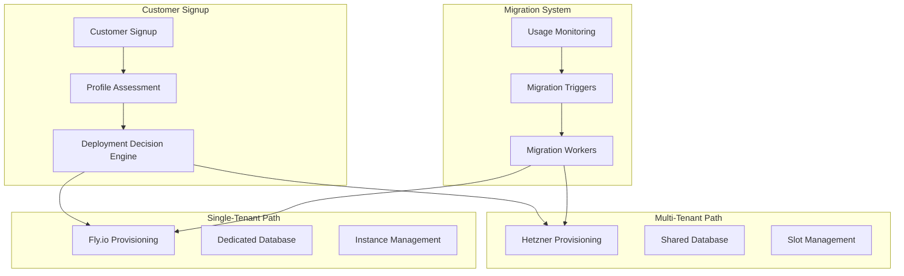

# WebHost Systems Deployment Mode Implementation Plan

## Overview

This document provides a comprehensive implementation plan for automatically selecting and managing deployment modes (multi-tenant vs single-tenant) based on customer subscription plans and requirements.

## Implementation Architecture



---

## Core Components

### 1. Deployment Decision Engine

Create `lib/webhost/infrastructure/deployment_decision_engine.ex`:

```elixir
defmodule WebHost.Infrastructure.DeploymentDecisionEngine do
  @moduledoc """
  Intelligent engine that determines optimal deployment mode based on
  customer profile, usage patterns, and business requirements.
  """

  alias WebHost.Accounts.{Customer, Subscription}
  alias WebHost.Billing.Plan
  alias WebHost.Infrastructure.{Provisioner, UsageTracker}

  @type customer_profile :: %{
    budget: number(),
    vehicle_count: integer(),
    compliance_requirements: [atom()],
    performance_needs: map(),
    geographic_distribution: [String.t()],
    usage_patterns: map()
  }

  @type deployment_decision :: %{
    mode: :multi_tenant | :single_tenant,
    infrastructure: :hetzner | :flyio,
    plan: atom(),
    reason: String.t(),
    confidence: float(),
    alternatives: [map()]
  }

  @doc """
  Analyze customer profile and recommend deployment mode
  """
  @spec recommend_deployment(customer_profile()) :: deployment_decision()
  def recommend_deployment(profile) do
    # Score-based decision making
    multi_tenant_score = calculate_multi_tenant_score(profile)
    single_tenant_score = calculate_single_tenant_score(profile)
    
    cond do
      multi_tenant_score > 0.8 ->
        build_decision(:multi_tenant, profile, multi_tenant_score)
      
      single_tenant_score > 0.8 ->
        build_decision(:single_tenant, profile, single_tenant_score)
      
      multi_tenant_score > single_tenant_score ->
        build_decision(:multi_tenant, profile, multi_tenant_score)
      
      true ->
        build_decision(:single_tenant, profile, single_tenant_score)
    end
  end

  @doc """
  Determine if customer should be migrated to different mode
  """
  @spec evaluate_migration(Customer.t()) :: {:migrate, deployment_decision()} | :stay
  def evaluate_migration(customer) do
    current_mode = get_current_deployment_mode(customer)
    usage_metrics = UsageTracker.get_current_usage(customer.id)
    profile = build_customer_profile(customer, usage_metrics)
    
    recommended = recommend_deployment(profile)
    
    if recommended.mode != current_mode and recommended.confidence > 0.7 do
      {:migrate, recommended}
    else
      :stay
    end
  end

  # Private functions

  defp calculate_multi_tenant_score(profile) do
    base_score = 0.5
    
    score = base_score
    |> apply_budget_scoring(profile.budget)
    |> apply_vehicle_count_scoring(profile.vehicle_count)
    |> apply_compliance_scoring(profile.compliance_requirements)
    |> apply_performance_scoring(profile.performance_needs)
    |> apply_geographic_scoring(profile.geographic_distribution)
    |> apply_usage_pattern_scoring(profile.usage_patterns)
    
    min(max(score, 0.0), 1.0)
  end

  defp calculate_single_tenant_score(profile) do
    base_score = 0.5
    
    score = base_score
    |> apply_budget_scoring_single_tenant(profile.budget)
    |> apply_vehicle_count_scoring_single_tenant(profile.vehicle_count)
    |> apply_compliance_scoring_single_tenant(profile.compliance_requirements)
    |> apply_performance_scoring_single_tenant(profile.performance_needs)
    |> apply_geographic_scoring_single_tenant(profile.geographic_distribution)
    
    min(max(score, 0.0), 1.0)
  end

  # Scoring functions

  defp apply_budget_scoring(score, budget) when budget < 50, do: score + 0.3
  defp apply_budget_scoring(score, budget) when budget < 100, do: score + 0.1
  defp apply_budget_scoring(score, _budget), do: score - 0.2

  defp apply_vehicle_count_scoring(score, vehicles) when vehicles <= 5, do: score + 0.2
  defp apply_vehicle_count_scoring(score, vehicles) when vehicles <= 10, do: score + 0.0
  defp apply_vehicle_count_scoring(score, _vehicles), do: score - 0.3

  defp apply_compliance_scoring(score, []), do: score + 0.1
  defp apply_compliance_scoring(score, compliance) when length(compliance) > 0, do: score - 0.4

  defp apply_performance_scoring(score, %{latency_requirement: latency}) when latency > 100, do: score + 0.1
  defp apply_performance_scoring(score, %{latency_requirement: latency}) when latency < 50, do: score - 0.3
  defp apply_performance_scoring(score, _performance), do: score

  defp apply_geographic_scoring(score, [_single_region]), do: score + 0.1
  defp apply_geographic_scoring(score, multiple_regions) when length(multiple_regions) > 1, do: score - 0.2

  defp apply_usage_pattern_scoring(score, %{peak_concurrent_users: users}) when users < 20, do: score + 0.1
  defp apply_usage_pattern_scoring(score, %{peak_concurrent_users: users}) when users > 100, do: score - 0.3
  defp apply_usage_pattern_scoring(score, _usage), do: score

  # Single-tenant scoring (inverse of multi-tenant)
  defp apply_budget_scoring_single_tenant(score, budget) when budget > 100, do: score + 0.3
  defp apply_budget_scoring_single_tenant(score, budget) when budget > 50, do: score + 0.1
  defp apply_budget_scoring_single_tenant(score, _budget), do: score - 0.2

  defp apply_vehicle_count_scoring_single_tenant(score, vehicles) when vehicles > 10, do: score + 0.3
  defp apply_vehicle_count_scoring_single_tenant(score, vehicles) when vehicles > 5, do: score + 0.1
  defp apply_vehicle_count_scoring_single_tenant(score, _vehicles), do: score - 0.1

  defp apply_compliance_scoring_single_tenant(score, compliance) when :soc2 in compliance, do: score + 0.4
  defp apply_compliance_scoring_single_tenant(score, compliance) when :hipaa in compliance, do: score + 0.5
  defp apply_compliance_scoring_single_tenant(score, _compliance), do: score

  defp apply_performance_scoring_single_tenant(score, %{latency_requirement: latency}) when latency < 50, do: score + 0.3
  defp apply_performance_scoring_single_tenant(score, %{latency_requirement: latency}) when latency < 100, do: score + 0.1
  defp apply_performance_scoring_single_tenant(score, _performance), do: score

  defp apply_geographic_scoring_single_tenant(score, multiple_regions) when length(multiple_regions) > 1, do: score + 0.3
  defp apply_geographic_scoring_single_tenant(score, _regions), do: score

  defp build_decision(mode, profile, confidence) do
    infrastructure = if mode == :multi_tenant, do: :hetzner, else: :flyio
    plan = determine_plan(mode, profile)
    reason = generate_reason(mode, profile, confidence)
    
    %{
      mode: mode,
      infrastructure: infrastructure,
      plan: plan,
      reason: reason,
      confidence: confidence,
      alternatives: generate_alternatives(mode, profile)
    }
  end

  defp determine_plan(:multi_tenant, _profile), do: :hobby
  defp determine_plan(:single_tenant, profile) do
    cond do
      profile.vehicle_count > 100 -> :business
      profile.vehicle_count > 25 -> :professional
      true -> :starter
    end
  end

  defp generate_reason(:multi_tenant, profile, confidence) do
    reasons = []
    reasons = if profile.budget < 50, do: ["Budget-conscious customer" | reasons], else: reasons
    reasons = if profile.vehicle_count <= 5, do: ["Small fleet size" | reasons], else: reasons
    reasons = if length(profile.compliance_requirements) == 0, do: ["No special compliance needs" | reasons], else: reasons
    
    "Recommended multi-tenant deployment: #{Enum.join(reasons, ", ")} (confidence: #{confidence})"
  end

  defp generate_reason(:single_tenant, profile, confidence) do
    reasons = []
    reasons = if profile.vehicle_count > 10, do: ["Large fleet requires dedicated resources" | reasons], else: reasons
    reasons = if :soc2 in profile.compliance_requirements, do: ["SOC 2 compliance required" | reasons], else: reasons
    reasons = if :hipaa in profile.compliance_requirements, do: ["HIPAA compliance required" | reasons], else: reasons
    reasons = if profile.performance_needs.latency_requirement < 50, do: ["High performance requirements" | reasons], else: reasons
    
    "Recommended single-tenant deployment: #{Enum.join(reasons, ", ")} (confidence: #{confidence})"
  end

  defp generate_alternatives(:multi_tenant, profile) do
    if profile.vehicle_count > 8 or length(profile.compliance_requirements) > 0 do
      [%{
        mode: :single_tenant,
        plan: :starter,
        reason: "Consider upgrading if growth continues",
        estimated_cost_increase: calculate_cost_increase(:multi_tenant, :single_tenant, profile)
      }]
    else
      []
    end
  end

  defp generate_alternatives(:single_tenant, profile) do
    if profile.vehicle_count <= 5 and profile.budget < 100 and length(profile.compliance_requirements) == 0 do
      [%{
        mode: :multi_tenant,
        plan: :hobby,
        reason: "Could save costs with shared resources",
        estimated_cost_savings: calculate_cost_savings(:single_tenant, :multi_tenant, profile)
      }]
    else
      []
    end
  end

  defp calculate_cost_increase(from, to, profile) do
    # Implementation for cost calculation
    0.0
  end

  defp calculate_cost_savings(from, to, profile) do
    # Implementation for cost calculation
    0.0
  end

  defp get_current_deployment_mode(customer) do
    case get_deployment(customer) do
      %{infrastructure_type: "hetzner"} -> :multi_tenant
      %{infrastructure_type: "flyio"} -> :single_tenant
      _ -> :multi_tenant  # Default
    end
  end

  defp get_deployment(customer) do
    # Fetch current deployment information
    nil
  end

  defp build_customer_profile(customer, usage_metrics) do
    %{
      budget: get_customer_budget(customer),
      vehicle_count: usage_metrics.vehicle_count,
      compliance_requirements: get_compliance_requirements(customer),
      performance_needs: get_performance_needs(customer),
      geographic_distribution: get_geographic_distribution(customer),
      usage_patterns: usage_metrics.patterns
    }
  end

  defp get_customer_budget(_customer), do: 50  # Default
  defp get_compliance_requirements(_customer), do: []
  defp get_performance_needs(_customer), do: %{latency_requirement: 100}
  defp get_geographic_distribution(_customer), do: ["US"]
end
```

### 2. Provisioning Integration

Create `lib/webhost/infrastructure/deployment_provisioner.ex`:

```elixir
defmodule WebHost.Infrastructure.DeploymentProvisioner do
  @moduledoc """
  Orchestrates the provisioning of infrastructure based on deployment decisions.
  """

  alias WebHost.Infrastructure.{DeploymentDecisionEngine, Provisioner}
  alias WebHost.Accounts.Customer
  alias WebHost.Workers.{HetznerProvisioningWorker, FlyioProvisioningWorker}

  @doc """
  Provision infrastructure for new customer based on decision engine analysis
  """
  @spec provision_for_customer(Customer.t(), map()) :: {:ok, map()} | {:error, term()}
  def provision_for_customer(customer, additional_profile \\ %{}) do
    # Build customer profile
    profile = build_customer_profile(customer, additional_profile)
    
    # Get deployment decision
    decision = DeploymentDecisionEngine.recommend_deployment(profile)
    
    # Log decision for audit
    log_deployment_decision(customer, decision)
    
    # Queue appropriate provisioning worker
    case decision.mode do
      :multi_tenant ->
        queue_hetzner_provisioning(customer, decision)
      
      :single_tenant ->
        queue_flyio_provisioning(customer, decision)
    end
  end

  @doc """
  Re-evaluate existing customer deployment and migrate if necessary
  """
  @spec evaluate_and_migrate(Customer.t()) :: :ok | {:error, term()}
  def evaluate_and_migrate(customer) do
    case DeploymentDecisionEngine.evaluate_migration(customer) do
      {:migrate, decision} ->
        initiate_migration(customer, decision)
      
      :stay ->
        :ok
    end
  end

  # Private functions

  defp build_customer_profile(customer, additional_profile) do
    base_profile = %{
      budget: get_customer_budget(customer),
      vehicle_count: get_current_vehicle_count(customer),
      compliance_requirements: get_compliance_requirements(customer),
      performance_needs: get_performance_needs(customer),
      geographic_distribution: get_geographic_distribution(customer),
      usage_patterns: get_usage_patterns(customer)
    }
    
    Map.merge(base_profile, additional_profile)
  end

  defp queue_hetzner_provisioning(customer, decision) do
    worker_args = %{
      "customer_id" => customer.id,
      "decision" => decision,
      "infrastructure_type" => "hetzner",
      "plan" => decision.plan
    }
    
    HetznerProvisioningWorker.new(worker_args)
    |> Oban.insert()
    
    {:ok, %{mode: :multi_tenant, worker: "HetznerProvisioningWorker", decision: decision}}
  end

  defp queue_flyio_provisioning(customer, decision) do
    worker_args = %{
      "customer_id" => customer.id,
      "decision" => decision,
      "infrastructure_type" => "flyio",
      "plan" => decision.plan,
      "regions" => determine_flyio_regions(decision.plan, customer)
    }
    
    FlyioProvisioningWorker.new(worker_args)
    |> Oban.insert()
    
    {:ok, %{mode: :single_tenant, worker: "FlyioProvisioningWorker", decision: decision}}
  end

  defp initiate_migration(customer, decision) do
    migration_args = %{
      "customer_id" => customer.id,
      "from_mode" => get_current_mode(customer),
      "to_mode" => decision.mode,
      "decision" => decision,
      "reason" => decision.reason
    }
    
    case decision.mode do
      :multi_tenant ->
        WebHost.Workers.MigrateToMultiTenantWorker.new(migration_args)
      
      :single_tenant ->
        WebHost.Workers.MigrateToSingleTenantWorker.new(migration_args)
    end
    |> Oban.insert()
    
    :ok
  end

  defp determine_flyio_regions(plan, customer) do
    case plan do
      :starter -> ["iad"]  # US East
      :professional -> ["iad", "fra"]  # US East + Europe
      :business -> ["iad", "fra", "sin"]  # Global
    end
  end

  defp log_deployment_decision(customer, decision) do
    Logger.info("Deployment decision for customer #{customer.id}: #{decision.mode} - #{decision.reason}")
    
    # Store decision in customer metadata for audit
    metadata = Map.merge(customer.metadata || %{}, %{
      "deployment_decision" => %{
        "mode" => decision.mode,
        "infrastructure" => decision.infrastructure,
        "plan" => decision.plan,
        "reason" => decision.reason,
        "confidence" => decision.confidence,
        "made_at" => DateTime.utc_now() |> DateTime.to_iso8601()
      }
    })
    
    customer
    |> Ash.Changeset.for_update(:update, %{metadata: metadata})
    |> Ash.update()
  end

  # Helper functions
  defp get_customer_budget(_customer), do: 50
  defp get_current_vehicle_count(_customer), do: 1
  defp get_compliance_requirements(_customer), do: []
  defp get_performance_needs(_customer), do: %{latency_requirement: 100}
  defp get_geographic_distribution(_customer), do: ["US"]
  defp get_usage_patterns(_customer), do: %{peak_concurrent_users: 5}
  defp get_current_mode(_customer), do: :multi_tenant
end
```

### 3. Usage Monitoring and Analysis

Create `lib/webhost/infrastructure/usage_tracker.ex`:

```elixir
defmodule WebHost.Infrastructure.UsageTracker do
  @moduledoc """
  Tracks customer usage patterns to inform deployment decisions and migrations.
  """

  use GenServer
  require Logger

  alias WebHost.Infrastructure.{DeploymentDecisionEngine, DeploymentProvisioner}
  alias WebHost.Accounts.Customer

  @check_interval :timer.hours(6)  # Check every 6 hours

  def start_link(opts) do
    GenServer.start_link(__MODULE__, opts, name: __MODULE__)
  end

  @impl GenServer
  def init(_opts) do
    # Schedule periodic checks
    schedule_usage_check()
    
    {:ok, %{
      last_check: DateTime.utc_now(),
      usage_cache: %{}
    }}
  end

  @impl GenServer
  def handle_info(:check_all_customers, state) do
    Logger.info("Starting usage analysis for all customers")
    
    # Check all active customers
    Customer
    |> Ash.Query.filter(status == :active)
    |> Ash.read!()
    |> Enum.each(&analyze_customer_usage/1)
    
    # Schedule next check
    schedule_usage_check()
    
    {:noreply, %{state | last_check: DateTime.utc_now()}}
  end

  @doc """
  Get current usage metrics for a customer
  """
  @spec get_current_usage(String.t()) :: map()
  def get_current_usage(customer_id) do
    GenServer.call(__MODULE__, {:get_usage, customer_id})
  end

  @impl GenServer
  def handle_call({:get_usage, customer_id}, _from, state) do
    usage = Map.get(state.usage_cache, customer_id, %{})
    {:reply, usage, state}
  end

  # Private functions

  defp schedule_usage_check do
    Process.send_after(self(), :check_all_customers, @check_interval)
  end

  defp analyze_customer_usage(customer) do
    usage_metrics = collect_usage_metrics(customer.id)
    
    # Cache usage metrics
    GenServer.cast(__MODULE__, {:cache_usage, customer.id, usage_metrics})
    
    # Check if migration is needed
    case DeploymentDecisionEngine.evaluate_migration(customer) do
      {:migrate, decision} ->
        Logger.info("Customer #{customer.id} recommended for migration: #{decision.reason}")
        trigger_migration_evaluation(customer, decision, usage_metrics)
      
      :stay ->
        Logger.debug("Customer #{customer.id} deployment mode is optimal")
    end
  end

  defp collect_usage_metrics(customer_id) do
    %{
      vehicle_count: count_vehicles(customer_id),
      gps_points_today: count_gps_points_today(customer_id),
      api_calls_today: count_api_calls_today(customer_id),
      storage_used_mb: calculate_storage_usage(customer_id),
      peak_concurrent_users: get_peak_concurrent_users(customer_id),
      average_response_time_ms: get_average_response_time(customer_id),
      error_rate: get_error_rate(customer_id),
      geographic_distribution: get_geographic_distribution(customer_id),
      growth_rate: calculate_growth_rate(customer_id),
      resource_utilization: get_resource_utilization(customer_id),
      patterns: analyze_usage_patterns(customer_id)
    }
  end

  defp count_vehicles(customer_id) do
    # Query vehicle count for customer
    0  # Placeholder
  end

  defp count_gps_points_today(customer_id) do
    # Query GPS points in last 24 hours
    0  # Placeholder
  end

  defp count_api_calls_today(customer_id) do
    # Query API calls in last 24 hours
    0  # Placeholder
  end

  defp calculate_storage_usage(customer_id) do
    # Calculate total storage usage
    0  # Placeholder
  end

  defp get_peak_concurrent_users(customer_id) do
    # Get peak concurrent users in last 24 hours
    0  # Placeholder
  end

  defp get_average_response_time(customer_id) do
    # Calculate average API response time
    0  # Placeholder
  end

  defp get_error_rate(customer_id) do
    # Calculate error rate percentage
    0.0  # Placeholder
  end

  defp get_geographic_distribution(customer_id) do
    # Analyze geographic distribution of requests
    ["US"]  # Placeholder
  end

  defp calculate_growth_rate(customer_id) do
    # Calculate month-over-month growth rate
    0.0  # Placeholder
  end

  defp get_resource_utilization(customer_id) do
    %{
      cpu_utilization: 0.5,
      memory_utilization: 0.6,
      database_connections: 5,
      disk_utilization: 0.3
    }
  end

  defp analyze_usage_patterns(customer_id) do
    %{
      peak_hours: [9, 10, 14, 15, 16],  # Business hours
      seasonal_patterns: :none,
      batch_operations: count_batch_operations(customer_id),
      real_time_operations: count_real_time_operations(customer_id)
    }
  end

  defp count_batch_operations(_customer_id), do: 10
  defp count_real_time_operations(_customer_id), do: 100

  defp trigger_migration_evaluation(customer, decision, usage_metrics) do
    # Create migration evaluation task
    evaluation_args = %{
      "customer_id" => customer.id,
      "decision" => decision,
      "usage_metrics" => usage_metrics,
      "auto_approve" => should_auto_approve_migration(customer, decision, usage_metrics)
    }
    
    WebHost.Workers.MigrationEvaluationWorker.new(evaluation_args)
    |> Oban.insert()
  end

  defp should_auto_approve_migration(customer, decision, usage_metrics) do
    # Auto-approve migration if:
    # 1. High confidence (>0.9)
    # 2. Clear performance or compliance issues
    # 3. Customer has been on current mode > 30 days
    
    confidence = decision.confidence
    days_on_current_mode = get_days_on_current_mode(customer)
    has_performance_issues = has_performance_issues?(usage_metrics)
    has_compliance_issues = has_compliance_issues?(customer)
    
    cond do
      confidence > 0.9 and (has_performance_issues or has_compliance_issues) ->
        true
      
      confidence > 0.95 and days_on_current_mode > 30 ->
        true
      
      true ->
        false
    end
  end

  defp get_days_on_current_mode(_customer), do: 60
  defp has_performance_issues?(usage_metrics) do
    usage_metrics.average_response_time_ms > 200 or
    usage_metrics.error_rate > 0.05 or
    usage_metrics.resource_utilization.cpu_utilization > 0.8
  end
  defp has_compliance_issues?(_customer), do: false

  @impl GenServer
  def handle_cast({:cache_usage, customer_id, usage_metrics}, state) do
    new_cache = Map.put(state.usage_cache, customer_id, usage_metrics)
    {:noreply, %{state | usage_cache: new_cache}}
  end
end
```

### 4. Migration Workers

Create `lib/webhost/workers/migration_evaluation_worker.ex`:

```elixir
defmodule WebHost.Workers.MigrationEvaluationWorker do
  use Oban.Worker,
    queue: :migration_evaluation,
    max_attempts: 3

  @impl Oban.Worker
  def perform(%Oban.Job{args: args}) do
    customer_id = args["customer_id"]
    decision = args["decision"]
    usage_metrics = args["usage_metrics"]
    auto_approve = args["auto_approve"]
    
    customer = WebHost.Accounts.Customer |> Ash.get!(customer_id)
    
    if auto_approve do
      Logger.info("Auto-approving migration for customer #{customer_id}")
      execute_migration(customer, decision)
    else
      Logger.info("Requiring manual approval for customer #{customer_id} migration")
      request_manual_approval(customer, decision, usage_metrics)
    end
  end

  defp execute_migration(customer, decision) do
    case decision.mode do
      :multi_tenant ->
        WebHost.Workers.MigrateToMultiTenantWorker.new(%{
          "customer_id" => customer.id,
          "reason" => decision.reason,
          "decision" => decision
        })
      
      :single_tenant ->
        WebHost.Workers.MigrateToSingleTenantWorker.new(%{
          "customer_id" => customer.id,
          "reason" => decision.reason,
          "decision" => decision
        })
    end
    |> Oban.insert()
  end

  defp request_manual_approval(customer, decision, usage_metrics) do
    # Send notification to admin team
    WebHost.Notifications.Admin.notify_migration_request(
      customer: customer,
      decision: decision,
      usage_metrics: usage_metrics
    )
  end
end
```

### 5. Customer Signup Integration

Update customer signup flow in `lib/webhost/accounts/customer.ex`:

```elixir
defmodule WebHost.Accounts.Customer do
  # ... existing code ...

  actions do
    # ... existing actions ...

    create :signup_with_intelligent_provisioning do
      accept [:name, :slug, :email, :company_name, :billing_email]
      argument :plan_slug, :string, allow_nil?: false
      argument :profile_overrides, :map, default: %{}
      
      validate present([:name, :slug, :email, :plan_slug])
      validate match(:slug, ~r/^[a-z0-9-]+$/)
      
      change set_attribute(:status, :active)
      
      # Trigger intelligent provisioning after customer creation
      change fn changeset, _context ->
        Ash.Changeset.after_action(changeset, fn _changeset, customer ->
          # Get plan details
          plan = WebHost.Billing.Plan
                 |> Ash.Query.for_read(:by_slug, %{slug: Ash.Changeset.get_argument(changeset, :plan_slug)})
                 |> Ash.read_one!()
          
          # Update customer with subscription
          {:ok, customer} = create_subscription_for_customer(customer, plan)
          
          # Trigger intelligent provisioning
          case WebHost.Infrastructure.DeploymentProvisioner.provision_for_customer(
            customer,
            Ash.Changeset.get_argument(changeset, :profile_overrides)
          ) do
            {:ok, provisioning_result} ->
              Logger.info("Provisioning queued for customer #{customer.id}: #{inspect(provisioning_result)}")
              {:ok, customer}
            
            {:error, reason} ->
              Logger.error("Failed to provision for customer #{customer.id}: #{inspect(reason)}")
              {:ok, customer}  # Still create customer, provisioning will be retried
          end
        end)
      end
    end
  end

  # ... existing code ...
end
```

### 6. API Endpoints for Manual Overrides

Create `lib/webhost_web/controllers/deployment_controller.ex`:

```elixir
defmodule WebHostWeb.DeploymentController do
  use WebHostWeb, :controller

  alias WebHost.Infrastructure.{DeploymentProvisioner, DeploymentDecisionEngine}
  alias WebHost.Accounts.Customer

  # Admin-only endpoints for manual deployment management

  def evaluate_deployment(conn, %{"customer_id" => customer_id}) do
    customer = Customer |> Ash.get!(customer_id)
    
    decision = DeploymentDecisionEngine.recommend_deployment(
      build_profile_from_params(customer, conn.body_params)
    )
    
    json(conn, %{
      customer_id: customer_id,
      current_deployment: get_current_deployment(customer),
      recommended: decision,
      usage_metrics: WebHost.Infrastructure.UsageTracker.get_current_usage(customer_id)
    })
  end

  def force_migration(conn, %{"customer_id" => customer_id, "target_mode" => target_mode}) do
    customer = Customer |> Ash.get!(customer_id)
    
    # Build manual decision
    decision = %{
      mode: String.to_atom(target_mode),
      infrastructure: if(target_mode == "multi_tenant", do: :hetzner, else: :flyio),
      plan: determine_plan_from_mode(target_mode),
      reason: "Manual migration requested by admin",
      confidence: 1.0
    }
    
    case DeploymentProvisioner.initiate_migration(customer, decision) do
      :ok ->
        json(conn, %{status: "success", message: "Migration queued"})
      
      {:error, reason} ->
        conn
        |> put_status(:bad_request)
        |> json(%{status: "error", message: inspect(reason)})
    end
  end

  def get_deployment_status(conn, %{"customer_id" => customer_id}) do
    customer = Customer |> Ash.get!(customer_id)
    
    deployment = get_current_deployment(customer)
    usage_metrics = WebHost.Infrastructure.UsageTracker.get_current_usage(customer_id)
    
    json(conn, %{
      customer_id: customer_id,
      deployment: deployment,
      usage_metrics: usage_metrics,
      migration_status: get_migration_status(customer_id)
    })
  end

  # Private functions

  defp build_profile_from_params(customer, params) do
    %{
      budget: Map.get(params, "budget", 50),
      vehicle_count: Map.get(params, "vehicle_count", 1),
      compliance_requirements: Map.get(params, "compliance_requirements", []),
      performance_needs: %{
        latency_requirement: Map.get(params, "latency_requirement", 100)
      },
      geographic_distribution: Map.get(params, "geographic_distribution", ["US"])
    }
  end

  defp get_current_deployment(_customer), do: %{mode: :multi_tenant, status: :active}
  defp get_migration_status(_customer_id), do: :none
  defp determine_plan_from_mode("multi_tenant"), do: :hobby
  defp determine_plan_from_mode("single_tenant"), do: :starter
end
```

---

## Configuration

### Add to router

Update `lib/webhost_web/router.ex`:

```elixir
defmodule WebHostWeb.Router do
  use WebHostWeb, :router

  # ... existing routes ...

  pipeline :admin do
    plug :admin_auth
  end

  scope "/api/admin", WebHostWeb do
    pipe_through [:api, :admin]

    post "/deployment/evaluate", DeploymentController, :evaluate_deployment
    post "/deployment/migrate", DeploymentController, :force_migration
    get "/deployment/status/:customer_id", DeploymentController, :get_deployment_status
  end
end
```

### Add to application supervision

Update `lib/webhost/application.ex`:

```elixir
defmodule WebHost.Application do
  def start(_type, _args) do
    children = [
      # ... existing children ...
      
      # Add usage tracker
      WebHost.Infrastructure.UsageTracker
    ]

    opts = [strategy: :one_for_one, name: WebHost.Supervisor]
    Supervisor.start_link(children, opts)
  end
end
```

---

## Testing

### Unit Tests

Create `test/webhost/infrastructure/deployment_decision_engine_test.exs`:

```elixir
defmodule WebHost.Infrastructure.DeploymentDecisionEngineTest do
  use WebHost.DataCase

  alias WebHost.Infrastructure.DeploymentDecisionEngine

  describe "recommend_deployment/1" do
    test "recommends multi-tenant for small budget, low vehicle count" do
      profile = %{
        budget: 30,
        vehicle_count: 3,
        compliance_requirements: [],
        performance_needs: %{latency_requirement: 150},
        geographic_distribution: ["US"],
        usage_patterns: %{peak_concurrent_users: 5}
      }

      decision = DeploymentDecisionEngine.recommend_deployment(profile)

      assert decision.mode == :multi_tenant
      assert decision.infrastructure == :hetzner
      assert decision.plan == :hobby
      assert decision.confidence > 0.8
    end

    test "recommends single-tenant for high compliance requirements" do
      profile = %{
        budget: 200,
        vehicle_count: 15,
        compliance_requirements: [:soc2],
        performance_needs: %{latency_requirement: 50},
        geographic_distribution: ["US", "EU"],
        usage_patterns: %{peak_concurrent_users: 50}
      }

      decision = DeploymentDecisionEngine.recommend_deployment(profile)

      assert decision.mode == :single_tenant
      assert decision.infrastructure == :flyio
      assert decision.plan in [:professional, :business]
      assert decision.confidence > 0.8
    end
  end
end
```

### Integration Tests

Create `test/webhost/infrastructure/deployment_provisioner_test.exs`:

```elixir
defmodule WebHost.Infrastructure.DeploymentProvisionerTest do
  use WebHost.DataCase

  alias WebHost.Infrastructure.DeploymentProvisioner
  alias WebHost.Accounts.Customer

  describe "provision_for_customer/2" do
    test "queues hetzner provisioning for hobby profile" do
      customer = insert(:customer)
      profile = %{budget: 30, vehicle_count: 2}

      assert {:ok, result} = DeploymentProvisioner.provision_for_customer(customer, profile)
      assert result.mode == :multi_tenant
      assert result.worker == "HetznerProvisioningWorker"
    end

    test "queues flyio provisioning for professional profile" do
      customer = insert(:customer)
      profile = %{budget: 200, vehicle_count: 50, compliance_requirements: [:soc2]}

      assert {:ok, result} = DeploymentProvisioner.provision_for_customer(customer, profile)
      assert result.mode == :single_tenant
      assert result.worker == "FlyioProvisioningWorker"
    end
  end
end
```

---

## Monitoring and Alerting

### Key Metrics to Monitor

1. **Deployment Decision Accuracy**
   - Track how often automated decisions match customer satisfaction
   - Monitor migration success rates
   - Measure customer retention by deployment mode

2. **Resource Utilization**
   - Multi-tenant server utilization
   - Single-tenant instance efficiency
   - Cost per customer by deployment mode

3. **Migration Triggers**
   - Frequency of mode changes
   - Time to detect need for migration
   - Migration completion time

### Dashboards

Create monitoring dashboards showing:
- Customer distribution across deployment modes
- Resource utilization by mode
- Migration trends and success rates
- Cost efficiency metrics

---

## Implementation Timeline

### Phase 1: Core Engine (2-3 days)
- [ ] Implement DeploymentDecisionEngine
- [ ] Create basic usage tracking
- [ ] Add unit tests

### Phase 2: Integration (2-3 days)
- [ ] Build DeploymentProvisioner
- [ ] Integrate with signup flow
- [ ] Create migration workers

### Phase 3: Monitoring (1-2 days)
- [ ] Implement UsageTracker GenServer
- [ ] Add monitoring and alerting
- [ ] Create admin API endpoints

### Phase 4: Testing (1-2 days)
- [ ] Comprehensive integration tests
- [ ] Migration testing
- [ ] Performance testing

### Total: 6-10 days

---

## Conclusion

This implementation plan provides a comprehensive system for intelligently selecting and managing deployment modes based on customer needs. The key benefits include:

1. **Automated Decision Making**: Reduces manual intervention in deployment choices
2. **Cost Optimization**: Ensures customers are on the most cost-effective infrastructure
3. **Performance Alignment**: Matches infrastructure performance to customer requirements
4. **Scalable Architecture**: Handles growth from hobby to enterprise seamlessly
5. **Audit Trail**: Complete visibility into deployment decisions and migrations

The system is designed to be conservative with migrations (requiring high confidence) while being responsive to changing customer needs. This ensures stability while maintaining flexibility for growth.

---

**Last Updated**: 2024-01-01  
**Author**: WebHost Systems Team  
**Version**: 1.0.0