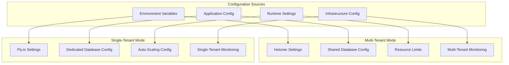

# WebHost Systems Deployment Configuration Guide

## Overview

This document outlines the configuration differences between multi-tenant and single-tenant deployment modes, including environment variables, application settings, and infrastructure-specific configurations.

## Configuration Architecture



---

## Environment Variables

### Core Application Variables

| Variable | Multi-Tenant | Single-Tenant | Description |
|----------|--------------|---------------|-------------|
| `DEPLOYMENT_MODE` | `multi_tenant` | `single_tenant` | Deployment mode identifier |
| `INFRASTRUCTURE_PROVIDER` | `hetzner` | `flyio` | Infrastructure provider |
| `DATABASE_URL` | Shared database URL | Dedicated database URL | PostgreSQL connection string |
| `REDIS_URL` | Shared Redis URL | Dedicated Redis URL | Redis connection string |
| `SECRET_KEY_BASE` | ✅ Required | ✅ Required | Application secret key |
| `TOKEN_SIGNING_SECRET` | ✅ Required | ✅ Required | JWT signing secret |

### Multi-Tenant Specific Variables

| Variable | Default | Description |
|----------|---------|-------------|
| `MAX_CUSTOMERS_PER_SERVER` | `150` | Maximum customers per Hetzner server |
| `SHARED_DATABASE_POOL_SIZE` | `20` | Database connection pool size |
| `CUSTOMER_RESOURCE_LIMITS_ENABLED` | `true` | Enable per-customer resource limits |
| `HETZNER_API_TOKEN` | Required | Hetzner API token |
| `HETZNER_SERVER_ID` | Required | Hetzner server ID |
| `STORAGE_BOX_URL` | Required | Hetzner storage box URL |
| `BACKUP_RETENTION_DAYS` | `30` | Backup retention period |

### Single-Tenant Specific Variables

| Variable | Default | Description |
|----------|---------|-------------|
| `FLY_API_TOKEN` | Required | Fly.io API token |
| `FLY_ORG_ID` | Required | Fly.io organization ID |
| `FLY_REGION` | `iad` | Primary Fly.io region |
| `FLY_REPLICAS` | `1` | Number of Fly.io replicas |
| `DEDICATED_DATABASE_POOL_SIZE` | `10` | Database connection pool size |
| `AUTO_SCALING_ENABLED` | `true` | Enable auto-scaling |
| `CDN_ENABLED` | `true` | Enable Cloudflare CDN |
| `MULTI_REGION_ENABLED` | `false` | Enable multi-region deployment |

---

## Application Configuration

### Multi-Tenant Configuration

```elixir
# config/prod.exs - Multi-tenant mode
import Config

config :webhost, WebHost.Repo,
  pool_size: String.to_integer(System.get_env("SHARED_DATABASE_POOL_SIZE", "20")),
  queue_target: 5000,
  queue_interval: 1000,
  ownership_timeout: 60_000,
  prepare: :unnamed,
  parameters: [
    application_name: "webhost_multi_tenant",
    statement_timeout: "30s",
    idle_in_transaction_session_timeout: "10s"
  ]

config :webhost, WebHost.PubSub,
  name: WebHost.PubSub,
  adapter: Phoenix.PubSub.PG2,
  pool_size: 10

config :webhost, :infrastructure,
  mode: :multi_tenant,
  provider: :hetzner,
  max_customers_per_server: String.to_integer(System.get_env("MAX_CUSTOMERS_PER_SERVER", "150")),
  resource_limits_enabled: String.to_existing_atom(System.get_env("CUSTOMER_RESOURCE_LIMITS_ENABLED", "true"))

config :webhost, :billing,
  enforce_plan_limits: true,
  auto_upgrade_threshold: 0.8,
  check_interval: :timer.hours(1)

config :webhost, :monitoring,
  per_customer_metrics: true,
  resource_usage_tracking: true,
  alert_on_overage: true

# Redis configuration (shared)
config :redix,
  name: :redix,
  host: get_redis_host(),
  port: get_redis_port(),
  password: get_redis_password(),
  pool_size: 10

# Hetzner-specific configuration
config :webhost, :hetzner,
  api_token: System.get_env("HETZNER_API_TOKEN"),
  server_id: String.to_integer(System.get_env("HETZNER_SERVER_ID")),
  storage_box_url: System.get_env("STORAGE_BOX_URL"),
  backup_retention_days: String.to_integer(System.get_env("BACKUP_RETENTION_DAYS", "30"))

# Logging configuration
config :logger, level: :info
config :logger, :console,
  format: "$time $metadata[$level] $message\n",
  metadata: [:request_id, :customer_id, :deployment_mode]
```

### Single-Tenant Configuration

```elixir
# config/prod.exs - Single-tenant mode
import Config

config :webhost, WebHost.Repo,
  pool_size: String.to_integer(System.get_env("DEDICATED_DATABASE_POOL_SIZE", "10")),
  queue_target: 1000,
  queue_interval: 500,
  ownership_timeout: 60_000,
  prepare: :named,
  parameters: [
    application_name: "webhost_single_tenant",
    statement_timeout: "60s",
    idle_in_transaction_session_timeout: "30s"
  ]

config :webhost, WebHost.PubSub,
  name: WebHost.PubSub,
  adapter: Phoenix.PubSub.PG2,
  pool_size: 5

config :webhost, :infrastructure,
  mode: :single_tenant,
  provider: :flyio,
  auto_scaling_enabled: String.to_existing_atom(System.get_env("AUTO_SCALING_ENABLED", "true")),
  cdn_enabled: String.to_existing_atom(System.get_env("CDN_ENABLED", "true")),
  multi_region_enabled: String.to_existing_atom(System.get_env("MULTI_REGION_ENABLED", "false"))

config :webhost, :billing,
  enforce_plan_limits: false,  # Customer has dedicated resources
  auto_scaling: true,
  usage_based_billing: true

config :webhost, :monitoring,
  infrastructure_health: true,
  performance_metrics: true,
  global_alerting: true

# Redis configuration (dedicated)
config :redix,
  name: :redix,
  host: get_redis_host(),
  port: get_redis_port(),
  password: get_redis_password(),
  pool_size: 5

# Fly.io-specific configuration
config :webhost, :flyio,
  api_token: System.get_env("FLY_API_TOKEN"),
  org_id: System.get_env("FLY_ORG_ID"),
  primary_region: System.get_env("FLY_REGION", "iad"),
  replica_regions: get_replica_regions(),
  app_name: System.get_env("FLY_APP_NAME"),
  memory_mb: String.to_integer(System.get_env("FLY_MEMORY_MB", "512")),
  cpu_kind: System.get_env("FLY_CPU_KIND", "shared")

# CDN configuration
config :webhost, :cdn,
  enabled: String.to_existing_atom(System.get_env("CDN_ENABLED", "true")),
  provider: :cloudflare,
  zone_id: System.get_env("CLOUDFLARE_ZONE_ID"),
  api_token: System.get_env("CLOUDFLARE_API_TOKEN")

# Logging configuration
config :logger, level: :info
config :logger, :console,
  format: "$time $metadata[$level] $message\n",
  metadata: [:request_id, :customer_id, :deployment_mode, :fly_region]
```

---

## Infrastructure-Specific Configurations

### Hetzner (Multi-Tenant) Configuration

#### Docker Compose Configuration
```yaml
# docker-compose.yml - Multi-tenant mode
version: '3.8'

services:
  webhost-app:
    build: .
    ports:
      - "4000:4000"
    environment:
      - DEPLOYMENT_MODE=multi_tenant
      - INFRASTRUCTURE_PROVIDER=hetzner
      - DATABASE_URL=postgresql://postgres:${POSTGRES_PASSWORD}@db:5432/webhost_prod
      - REDIS_URL=redis://redis:6379
      - MAX_CUSTOMERS_PER_SERVER=150
      - SHARED_DATABASE_POOL_SIZE=20
    depends_on:
      - db
      - redis
    volumes:
      - ./logs:/app/logs
      - ./backups:/backups
    restart: unless-stopped

  db:
    image: timescale/timescaledb:latest-pg15
    environment:
      - POSTGRES_DB=webhost_prod
      - POSTGRES_USER=postgres
      - POSTGRES_PASSWORD=${POSTGRES_PASSWORD}
    volumes:
      - postgres_data:/var/lib/postgresql/data
      - ./scripts/init-timescaledb.sh:/docker-entrypoint-initdb.d/init-timescaledb.sh
    ports:
      - "5432:5432"
    restart: unless-stopped

  redis:
    image: redis:7-alpine
    ports:
      - "6379:6379"
    volumes:
      - redis_data:/data
    restart: unless-stopped

  nginx:
    image: nginx:alpine
    ports:
      - "80:80"
      - "443:443"
    volumes:
      - ./nginx/nginx.conf:/etc/nginx/nginx.conf
      - ./ssl:/etc/nginx/ssl
    depends_on:
      - webhost-app
    restart: unless-stopped

volumes:
  postgres_data:
  redis_data:
```

#### Nginx Configuration
```nginx
# nginx/nginx.conf - Multi-tenant reverse proxy
events {
    worker_connections 1024;
}

http {
    upstream webhost_app {
        server webhost-app:4000;
    }

    # Rate limiting per customer
    limit_req_zone $binary_remote_addr zone=api:10m rate=10r/s;
    limit_req_zone $binary_remote_addr zone=upload:10m rate=2r/s;

    server {
        listen 80;
        server_name _;
        return 301 https://$server_name$request_uri;
    }

    server {
        listen 443 ssl http2;
        server_name _;

        ssl_certificate /etc/nginx/ssl/cert.pem;
        ssl_certificate_key /etc/nginx/ssl/key.pem;

        # API endpoints
        location /api/ {
            limit_req zone=api burst=20 nodelay;
            proxy_pass http://webhost_app;
            proxy_set_header Host $host;
            proxy_set_header X-Real-IP $remote_addr;
            proxy_set_header X-Forwarded-For $proxy_add_x_forwarded_for;
            proxy_set_header X-Forwarded-Proto $scheme;
        }

        # Upload endpoints
        location /api/upload {
            limit_req zone=upload burst=5 nodelay;
            client_max_body_size 50M;
            proxy_pass http://webhost_app;
            proxy_set_header Host $host;
            proxy_set_header X-Real-IP $remote_addr;
        }

        # WebSocket connections
        location /socket {
            proxy_pass http://webhost_app;
            proxy_http_version 1.1;
            proxy_set_header Upgrade $http_upgrade;
            proxy_set_header Connection "upgrade";
            proxy_set_header Host $host;
        }
    }
}
```

### Fly.io (Single-Tenant) Configuration

#### fly.toml Configuration
```toml
# fly.toml - Single-tenant deployment
app = "webhost-customer-{{CUSTOMER_ID}}"
primary_region = "iad"

[build]
  dockerfile = "Dockerfile"

[env]
  DEPLOYMENT_MODE = "single_tenant"
  INFRASTRUCTURE_PROVIDER = "flyio"
  DEDICATED_DATABASE_POOL_SIZE = "10"
  AUTO_SCALING_ENABLED = "true"
  CDN_ENABLED = "true"

[[services]]
  protocol = "tcp"
  internal_port = 4000

  [[services.ports]]
    port = 80
    handlers = ["http"]

  [[services.ports]]
    port = 443
    handlers = ["tls", "http"]

  [[services.tcp_checks]]
    interval = "15s"
    timeout = "2s"
    grace_period = "5s"

  [[services.http_checks]]
    interval = "10s"
    timeout = "2s"
    grace_period = "5s"
    method = "get"
    path = "/health"

[[vm]]
  memory = "512mb"
  cpu_kind = "shared"
  cpus = 1

[metrics]
  port = 9091
  path = "/metrics"

# Auto-scaling configuration
[[autoscale]]
  min = 1
  max = 5
  type = "cpu"
  target = 70

[[autoscale]]
  min = 1
  max = 3
  type = "memory"
  target = 80

# Multi-region configuration (for business tier)
[[deploy]]
  region = "iad"

[[deploy]]
  region = "fra"

[[deploy]]
  region = "sin"
```

#### Dockerfile for Fly.io
```dockerfile
# Dockerfile - Single-tenant optimized
FROM hexpm/elixir:1.15-erlang-26-alpine AS builder

WORKDIR /app

# Install build dependencies
RUN apk add --no-cache build-base git python3

# Install hex and rebar
RUN mix local.hex --force && mix local.rebar --force

# Copy dependencies
COPY mix.exs mix.lock ./
RUN mix deps.get --only prod
RUN mix deps.compile

# Copy application
COPY . .

# Compile and build release
ENV MIX_ENV=prod
RUN mix compile
RUN mix release

# Runtime image
FROM alpine:3.18

RUN apk add --no-cache openssl ncurses-libs libstdc++ postgresql-client

WORKDIR /app

# Create non-root user
RUN addgroup -g 1000 -S appuser && \
    adduser -S appuser -u 1000 -G appuser

COPY --from=builder /app/_build/prod/rel/webhost ./
RUN chown -R appuser:appuser /app

USER appuser

ENV HOME=/app

# Health check
HEALTHCHECK --interval=10s --timeout=5s --start-period=5s --retries=3 \
  CMD ./bin/webhost eval "WebHost.Repo.query(\"SELECT 1\")" && curl -f http://localhost:4000/health || exit 1

CMD ["bin/webhost", "start"]
```

---

## Database Configuration Differences

### Multi-Tenant Database Settings

```elixir
# Multi-tenant database configuration
config :webhost, WebHost.Repo,
  pool_size: 20,
  queue_target: 5000,
  queue_interval: 1000,
  ownership_timeout: 60_000,
  prepare: :unnamed,  # Better for multi-tenant
  parameters: [
    application_name: "webhost_multi_tenant",
    statement_timeout: "30s",
    idle_in_transaction_session_timeout: "10s",
    shared_preload_libraries: "timescaledb",
    max_connections: 200
  ]

# TimescaleDB settings for multi-tenant
config :webhost, :timescaledb,
  compression_enabled: true,
  compression_interval: "7 days",
  retention_enabled: true,
  default_retention_period: "30 days",
  chunk_time_interval: "1 day"
```

### Single-Tenant Database Settings

```elixir
# Single-tenant database configuration
config :webhost, WebHost.Repo,
  pool_size: 10,
  queue_target: 1000,
  queue_interval: 500,
  ownership_timeout: 60_000,
  prepare: :named,  # Better for single-tenant
  parameters: [
    application_name: "webhost_single_tenant",
    statement_timeout: "60s",
    idle_in_transaction_session_timeout: "30s",
    shared_preload_libraries: "timescaledb",
    max_connections: 100
  ]

# TimescaleDB settings for single-tenant
config :webhost, :timescaledb,
  compression_enabled: true,
  compression_interval: "30 days",
  retention_enabled: true,
  default_retention_period: "365 days",
  chunk_time_interval: "1 hour"
```

---

## Monitoring and Logging Configuration

### Multi-Tenant Monitoring

```elixir
# Multi-tenant monitoring configuration
config :webhost, :monitoring,
  per_customer_metrics: true,
  resource_usage_tracking: true,
  alert_on_overage: true,
  metrics_collection_interval: :timer.minutes(5),
  retention_days: 30

# Prometheus configuration
config :prometheus, WebHost.PrometheusExporter,
  enabled: true,
  path: "/metrics",
  registry: :default,
  auth: false

# Custom metrics for multi-tenant
config :webhost, :metrics,
  customer_count: true,
  resource_utilization: true,
  query_performance: true,
  error_rates: true
```

### Single-Tenant Monitoring

```elixir
# Single-tenant monitoring configuration
config :webhost, :monitoring,
  infrastructure_health: true,
  performance_metrics: true,
  global_alerting: true,
  metrics_collection_interval: :timer.minutes(1),
  retention_days: 90

# Enhanced monitoring for single-tenant
config :webhost, :metrics,
  response_time_histograms: true,
  throughput_counters: true,
  error_tracking: true,
  resource_monitoring: true,
  auto_scaling_metrics: true
```

---

## Security Configuration

### Multi-Tenant Security

```elixir
# Multi-tenant security configuration
config :webhost, :security,
  tenant_isolation: :database_level,
  rate_limiting: :per_customer,
  api_key_validation: true,
  request_logging: true,
  audit_trail: true

# Rate limiting configuration
config :webhost, WebHostWeb.Plugs.RateLimit,
  limits: [
    {"api", {100, 60}},      # 100 requests per minute per customer
    {"upload", {10, 60}},     # 10 uploads per minute per customer
    {"gps", {1000, 60}}       # 1000 GPS points per minute per customer
  ],
  backend: {Redix, :redix}
```

### Single-Tenant Security

```elixir
# Single-tenant security configuration
config :webhost, :security,
  tenant_isolation: :infrastructure_level,
  rate_limiting: :global,
  api_key_validation: true,
  request_logging: true,
  audit_trail: true,
  ssl_enforcement: true

# Enhanced security for single-tenant
config :webhost, :security,
  ddos_protection: true,
  ip_whitelisting: false,
  certificate_pinning: true,
  end_to_end_encryption: true
```

---

## Performance Tuning

### Multi-Tenant Performance

```elixir
# Multi-tenant performance configuration
config :webhost, :performance,
  connection_pooling: :shared,
  query_caching: true,
  result_compression: true,
  batch_operations: true,
  async_processing: true

# Phoenix endpoint configuration
config :webhost, WebHostWeb.Endpoint,
  cache_static_manifest: "priv/static/cache_manifest.json",
  server: true,
  pubsub_server: WebHost.PubSub,
  render_errors: [
    view: WebHostWeb.ErrorView,
    accepts: ~w(html json),
    layout: false
  ]
```

### Single-Tenant Performance

```elixir
# Single-tenant performance configuration
config :webhost, :performance,
  connection_pooling: :dedicated,
  query_caching: true,
  result_compression: false,  # Not needed with dedicated resources
  batch_operations: true,
  async_processing: true,
  parallel_queries: true

# Enhanced performance for single-tenant
config :webhost, :performance,
  connection_keepalive: true,
  query_optimization: true,
  index_tuning: true,
  materialized_views: true
```

---

## Configuration Validation

### Runtime Configuration Check

```elixir
defmodule WebHost.ConfigValidator do
  @moduledoc """
  Validates configuration based on deployment mode
  """

  def validate_config do
    deployment_mode = get_deployment_mode()
    
    case deployment_mode do
      :multi_tenant ->
        validate_multi_tenant_config()
      
      :single_tenant ->
        validate_single_tenant_config()
      
      _ ->
        {:error, "Invalid deployment mode: #{deployment_mode}"}
    end
  end

  defp validate_multi_tenant_config do
    errors = []
    
    errors = if System.get_env("MAX_CUSTOMERS_PER_SERVER") do
      errors
    else
      ["MAX_CUSTOMERS_PER_SERVER is required for multi-tenant mode" | errors]
    end
    
    errors = if System.get_env("HETZNER_API_TOKEN") do
      errors
    else
      ["HETZNER_API_TOKEN is required for multi-tenant mode" | errors]
    end
    
    if length(errors) == 0 do
      :ok
    else
      {:error, Enum.join(errors, ", ")}
    end
  end

  defp validate_single_tenant_config do
    errors = []
    
    errors = if System.get_env("FLY_API_TOKEN") do
      errors
    else
      ["FLY_API_TOKEN is required for single-tenant mode" | errors]
    end
    
    errors = if System.get_env("FLY_ORG_ID") do
      errors
    else
      ["FLY_ORG_ID is required for single-tenant mode" | errors]
    end
    
    if length(errors) == 0 do
      :ok
    else
      {:error, Enum.join(errors, ", ")}
    end
  end

  defp get_deployment_mode do
    System.get_env("DEPLOYMENT_MODE", "multi_tenant")
    |> String.to_atom()
  end
end
```

---

## Configuration Management Scripts

### Environment Setup Script

```bash
#!/bin/bash
# scripts/setup-environment.sh

set -e

DEPLOYMENT_MODE=${1:-multi_tenant}
echo "Setting up environment for deployment mode: $DEPLOYMENT_MODE"

case $DEPLOYMENT_MODE in
  "multi_tenant")
    echo "Configuring multi-tenant environment..."
    
    # Required environment variables
    export DEPLOYMENT_MODE=multi_tenant
    export INFRASTRUCTURE_PROVIDER=hetzner
    export MAX_CUSTOMERS_PER_SERVER=${MAX_CUSTOMERS_PER_SERVER:-150}
    export SHARED_DATABASE_POOL_SIZE=${SHARED_DATABASE_POOL_SIZE:-20}
    
    # Check required variables
    if [ -z "$HETZNER_API_TOKEN" ]; then
      echo "Error: HETZNER_API_TOKEN is required"
      exit 1
    fi
    
    if [ -z "$HETZNER_SERVER_ID" ]; then
      echo "Error: HETZNER_SERVER_ID is required"
      exit 1
    fi
    
    # Generate configuration files
    envsubst < config/multi-tenant.env.template > .env
    
    echo "Multi-enant environment configured successfully"
    ;;
    
  "single_tenant")
    echo "Configuring single-tenant environment..."
    
    # Required environment variables
    export DEPLOYMENT_MODE=single_tenant
    export INFRASTRUCTURE_PROVIDER=flyio
    export DEDICATED_DATABASE_POOL_SIZE=${DEDICATED_DATABASE_POOL_SIZE:-10}
    export AUTO_SCALING_ENABLED=${AUTO_SCALING_ENABLED:-true}
    
    # Check required variables
    if [ -z "$FLY_API_TOKEN" ]; then
      echo "Error: FLY_API_TOKEN is required"
      exit 1
    fi
    
    if [ -z "$FLY_ORG_ID" ]; then
      echo "Error: FLY_ORG_ID is required"
      exit 1
    fi
    
    # Generate configuration files
    envsubst < config/single-tenant.env.template > .env
    
    # Generate fly.toml
    envsubst < config/fly.toml.template > fly.toml
    
    echo "Single-tenant environment configured successfully"
    ;;
    
  *)
    echo "Error: Invalid deployment mode. Use 'multi_tenant' or 'single_tenant'"
    exit 1
    ;;
esac

echo "Environment setup complete!"
```

### Configuration Validation Script

```bash
#!/bin/bash
# scripts/validate-config.sh

echo "Validating configuration..."

# Validate deployment mode
DEPLOYMENT_MODE=${DEPLOYMENT_MODE:-multi_tenant}
echo "Deployment mode: $DEPLOYMENT_MODE"

# Validate required environment variables
case $DEPLOYMENT_MODE in
  "multi_tenant")
    REQUIRED_VARS=("DATABASE_URL" "REDIS_URL" "SECRET_KEY_BASE" "HETZNER_API_TOKEN" "HETZNER_SERVER_ID")
    ;;
  "single_tenant")
    REQUIRED_VARS=("DATABASE_URL" "REDIS_URL" "SECRET_KEY_BASE" "FLY_API_TOKEN" "FLY_ORG_ID")
    ;;
esac

MISSING_VARS=()

for var in "${REQUIRED_VARS[@]}"; do
  if [ -z "${!var}" ]; then
    MISSING_VARS+=("$var")
  fi
done

if [ ${#MISSING_VARS[@]} -gt 0 ]; then
  echo "Error: Missing required environment variables:"
  printf '  %s\n' "${MISSING_VARS[@]}"
  exit 1
fi

# Test database connection
echo "Testing database connection..."
mix ecto.ping || {
  echo "Error: Database connection failed"
  exit 1
}

# Test Redis connection
echo "Testing Redis connection..."
mix cmd --eval "Redix.command(:redix, [\"PING\"])" || {
  echo "Error: Redis connection failed"
  exit 1
}

echo "Configuration validation passed!"
```

---

## Troubleshooting

### Common Configuration Issues

#### Multi-Tenant Issues

1. **Database Connection Pool Exhaustion**
   ```
   Error: Too many connections to database
   Solution: Increase SHARED_DATABASE_POOL_SIZE or add connection pooling
   ```

2. **Resource Limit Violations**
   ```
   Error: Customer exceeded plan limits
   Solution: Check CUSTOMER_RESOURCE_LIMITS_ENABLED setting
   ```

3. **Hetzner API Authentication**
   ```
   Error: Hetzner API authentication failed
   Solution: Verify HETZNER_API_TOKEN is valid and has proper permissions
   ```

#### Single-Tenant Issues

1. **Fly.io Deployment Failures**
   ```
   Error: Fly.io deployment failed
   Solution: Check FLY_API_TOKEN and FLY_ORG_ID are correct
   ```

2. **Auto-Scaling Not Working**
   ```
   Error: Auto-scaling not responding to load
   Solution: Verify AUTO_SCALING_ENABLED is set to true
   ```

3. **CDN Configuration Issues**
   ```
